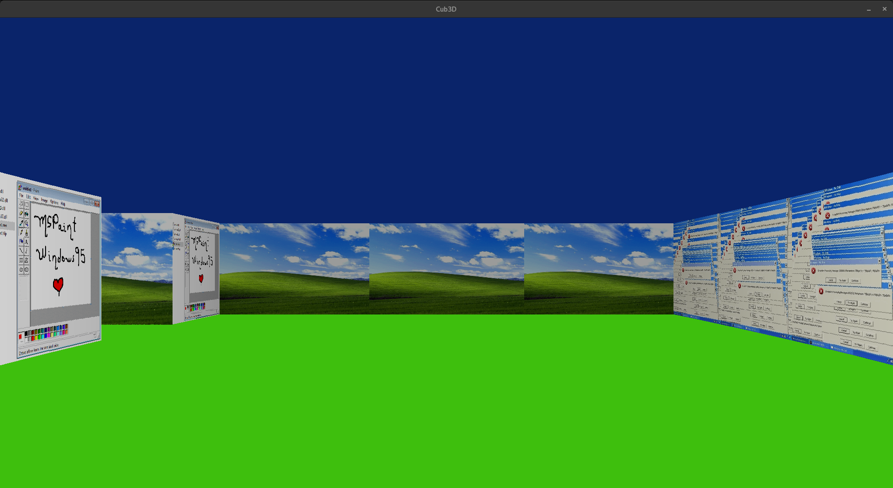
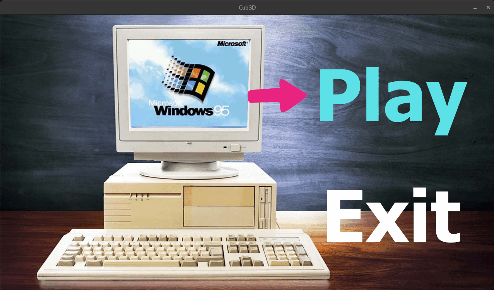
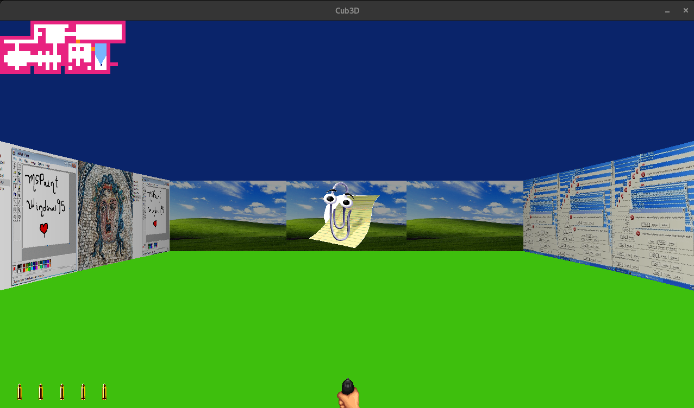
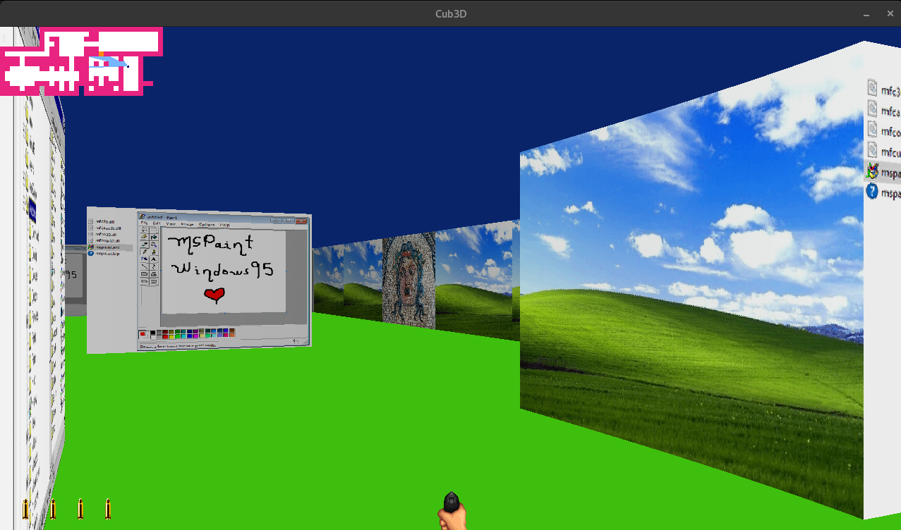

[https://github.com/ayogun/42-project-badges/blob/main/badges/cub3de.png](https://github.com/ayogun/42-project-badges/blob/main/badges/cub3de.png)

# 🧱 Cub3D

A 3D rendering engine written in **C**, using the **raycasting technique** (like in early games such as Wolfenstein 3D).  
This project was part of the 42 curriculum and was developed in a **2-person team** with [Alan](https://github.com/aelaen-1) 👥.

> 🎯 Goal: display a 3D view of a 2D map, based on the player’s position and direction, using a custom-built raycaster.


## ⚙️ Tech Stack

- C (no external libraries allowed, except `mlx`)
- Makefile
- MinilibX (42's basic graphic library)
- Raycasting algorithm (DDA)
- Texture mapping & simple rendering pipeline


## 🧠 What I Learned

Beyond graphics and math, this project helped me develop key **soft skills**:
- *Teamwork:* clear task splitting, pair programming sessions, regular syncs
- *Problem solving:* debugging rendering bugs, managing floating-point imprecision, fixing wall glitches
- *Project architecture:* thinking modular (raycasting, input, rendering, map parsing…)
- *Creativity under constraints:* designing a visual experience with limited resources
- *Resilience:* many iterations, refactors, and late-night debugging


## 🔍 Features

✅ Real-time 3D rendering using raycasting  
✅ Wall collision and player movement  
✅ Textured walls based on orientation (N, S, E, W)  
✅ Custom map parsing (`.cub` file format)  
✅ HUD elements (compass, info bar…)  
✅ Input controls (WASD, arrow keys, ESC)  
✅ Directional rotation (left/right)

## ✨ Bonus Features

🎯 We had fun pushing the project beyond the mandatory requirements! Here's what we added:

- 🧍‍♂️ **Sprite rendering** (objects & decor elements)
- 🚪 **Interactive doors** that open and close based on proximity
- 🧭 **Minimap** with real-time player position and wall layout
- 🖱️ **Mouse movement** support for smooth camera rotation
- 🔫 **Animated weapon** with shooting action and ammo management
- 🧩 **Menu** (start and quit options)

All visuals were custom-integrated using **XPM textures**, with smooth transitions and a creative retro vibe 🎮


## 🖼️ Preview

<p align="center">
  
  
  
  
</p>


## 🗂️ Project Structure

```
.
├── srcs/
│   ├── main.c
│   ├── raycasting.c/
│   └── .../
# Core of the rendering logic 
├── includes/
│   ├── struct.h
│   └── cub3d.h
# Header files with structures and functions declarations
├── bonus/
# All the `.c` files for the bonus features
├── libft/
# Personal function library
├── maps/
# All the `.cub` maps
├── minilibx-linux/
# The graphic library from 42
├── textures/
# All the `.xpm` files
├── Makefile
└── README.md
```


## 📚 Resources

- [Lode’s Computer Graphics Tutorial (Raycasting)](https://lodev.org/cgtutor/raycasting.html)
- [Javidx9 Raycasting Engine video](https://www.youtube.com/watch?v=NbSee-XM7WA)
- [Simplified Raycasting explanation](https://www.youtube.com/watch?v=G9i78WoBBIU)
- MinilibX documentation (very limited 😅)


## 👨‍💻 Authors

- [Emma Blanchard](https://github.com/Emma-blnch)  
- [Alan](https://github.com/aelaen-1)
